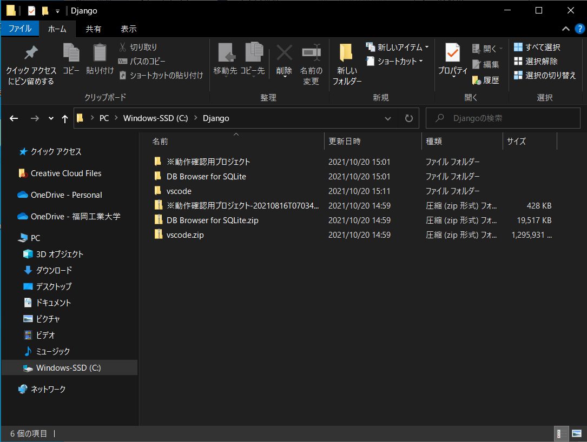

# 開発環境のダウンロード手順

## 1.クラウドアプリ開発の環境構築

1. teamsから開発環境のzipファイルをダウンロードする．(ダウンロード先はダウンロードでOK) 

2. Cドライブに「Django」フォルダを作成

3. 「Django」フォルダの中にダウンロードしたzipファイルを展開(展開するのに2時間くらいかかります)

    - 展開するとこんな感じになります．(C://Django/ここに展開)
 

4. [README](../README.md)に戻ってリポジトリをクローンする

## 2. ローカルにリポジトリを保存する(cloneする)
コマンドプロンプトを開く．以下のコマンドを実行し，リポジトリをクローンしたいディレクトリに移動する．(1の開発環境以外の場所にある場合は各自で変更お願いします)
    
    cd C://Django/vscode/Workspace
 
リポジトリをクローンする．(URLは各自で変更してください)

    git clone https://github.com/自分のGithub_id/calendar.git
    
## 2.VScodeの開き方
1. **C://Django/vscode/VisualStudioCode.bat** ファイルをクリック。すると、VSCodeが開く!(batファイルから開かないと，5.のactivate envができません．)

2. ファイル → Open Folder → vscode/Workspace/calendarを選択。
3. ターミナルを開き、「powershell」になっている人は、「cmd」に変更！
4. 「cmd」になっている事を確認したら、activate envのコマンドを打つ!      

        activate env